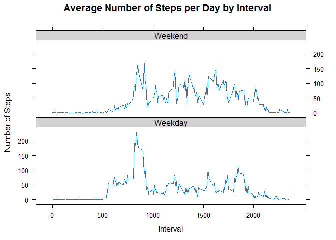

This assignment makes use of data from a personal activity monitoring
device. This device collects data at 5 minute intervals through out the
day. The data consists of two months of data from an anonymous
individual collected during the months of October and November, 2012 and
include the number of steps taken in 5 minute intervals each day.

The variables included in this dataset are:

-   steps: Number of steps taking in a 5-minute interval (missing values
    are coded as NA)
-   date: The date on which the measurement was taken in YYYY-MM-DD
    format
-   interval: Identifier for the 5-minute interval in which measurement
    was taken

The dataset is stored in a comma-separated-value (CSV) file and there
are a total of 17,568 observations in this dataset.

Loading and preprocessing the data
----------------------------------

    setwd("~/Data Science/Reproducible Research")
    rm(list=ls())
    data = read.csv("activity.csv")

**Histogram of the total number of steps taken each day**

    totalSteps <- aggregate(steps ~ date, data = data, na.rm = TRUE, sum)

    hist(totalSteps$steps, main = paste("Total Steps Taken Each Day"), xlab = "Steps Every Day", col="orange")

\#\# What is mean total number of steps taken per day? **Mean and median
number of steps taken each day**

    mean(totalSteps$steps)

    ## [1] 10766.19

    median(totalSteps$steps)

    ## [1] 10765

What is the average daily activity pattern?
-------------------------------------------

    stepsInterval <- aggregate(steps ~ interval, data = data, mean, na.rm = TRUE)
    plot(stepsInterval$interval,stepsInterval$steps, type="l", xlab="Interval", ylab="Number of Steps",main="Average Number of Steps per Day by Interval")

**Which 5-minute interval, on average across all the days in the
dataset, ** **contains the maximum number of steps?**

    stepsInterval[which.max(stepsInterval$steps), ]$interval

    ## [1] 835

Imputing missing values
-----------------------

The following is the number of days/intervals where there are missing
values (coded as NA). The presence of missing days may introduce bias
into some calculations or summaries of the data.

    sum(is.na(data$steps))

    ## [1] 2304

Therefore, we will be imputing the missing values with the average
number of steps per day/interval.

    replace_data <- transform(data, steps = ifelse(is.na(data$steps), stepsInterval$steps[match(data$interval, stepsInterval$interval)], data$steps))

    newsteps <- aggregate(steps ~ date, replace_data, sum)
    hist(newsteps$steps, main = paste("Total Steps Taken Each Day"), col="blue", xlab="Number of Steps")

**New mean and median for imputed data**

    mean(newsteps$steps)

    ## [1] 10766.19

    median(newsteps$steps)

    ## [1] 10766.19

Imputing the data with the average did not change the mean and only
pushed the median up by 1.2 steps.

But imputing the data with the average did push up the total number of
steps by:

    sum(newsteps$steps) - sum(totalSteps$steps)

    ## [1] 86129.51

Are there differences in activity patterns between weekdays and weekends?
-------------------------------------------------------------------------

    library(lattice)

    weekdays <- c("Monday", "Tuesday", "Wednesday", "Thursday", 
                  "Friday")
    replace_data$dow = as.factor(ifelse(is.element(weekdays(as.Date(replace_data$date)),weekdays), "Weekday", "Weekend"))

    newsteps <- aggregate(steps ~ interval + dow, replace_data, mean)

    xyplot(newsteps$steps ~ newsteps$interval|newsteps$dow, main="Average Number of Steps per Day by Interval",xlab="Interval", ylab="Number of Steps",layout=c(1,2), type="l", par.settings = list(strip.background=list(col="lightgrey")))

